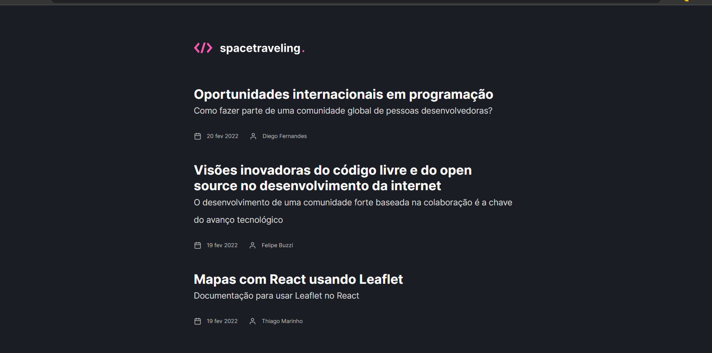

# Desafio Ignite criação de um blog (spacetraveling) com o Next

## Tecnologias utilizadas ⚙️
- Next
- React
- SASS
- Prismic CMS
- Typescript
- Eslint e prettier
- Utteranc

## Habilidades desenvolvidas 🚀
- Utilização de CMS para criação de posts
- Paginação com o Next
- GetStaticProps e GetStaticPaths

## 💻 Sobre o desafio

Nesse desafio, eu deveria criar uma aplicação para treinar o que aprendi até agora no ReactJS

Essa é uma aplicação onde o meu principal objetivo é criar um blog do zero. Recebi uma aplicação em branco que deve consumir os dados do Prismic e ter a interface implementada conforme o layout do Figma. Tive acesso a diversos arquivos para implementar:

- Estilizações global, comum e individuais;
- Importação de fontes Google;
- Paginação de posts;
- Cálculo de tempo estimado de leitura do post;
- Geração de páginas estáticas com os métodos `getStaticProps` e `getStaticPaths`;
- Formatação de datas com `date-fns`;
- Uso de ícones com `react-icons`;
- Requisições HTTP com `fetch`;
- Comentários com o Utteranc;
- Preview do documento Prismic;
- Navegação entre post anterior e próximo;
- Informação de edição do post;
- Entre outros.

## Extra miles
[x] Se o post foi editado, colocar a data e a hora da edição
[] Navegação entre posts
[] Comentários com o Utteranc
[] Preview do documento Prismic

## Aplicação

## Template da aplicação

Para realizar esse desafio, criamos para você esse modelo que você deve utilizar como um template do GitHub.

O template está disponível na seguinte URL:

<a href="https://github.com/rocketseat-education/ignite-template-reactjs-criando-um-projeto-do-zero" target="_blank">Link do repositório</a>
